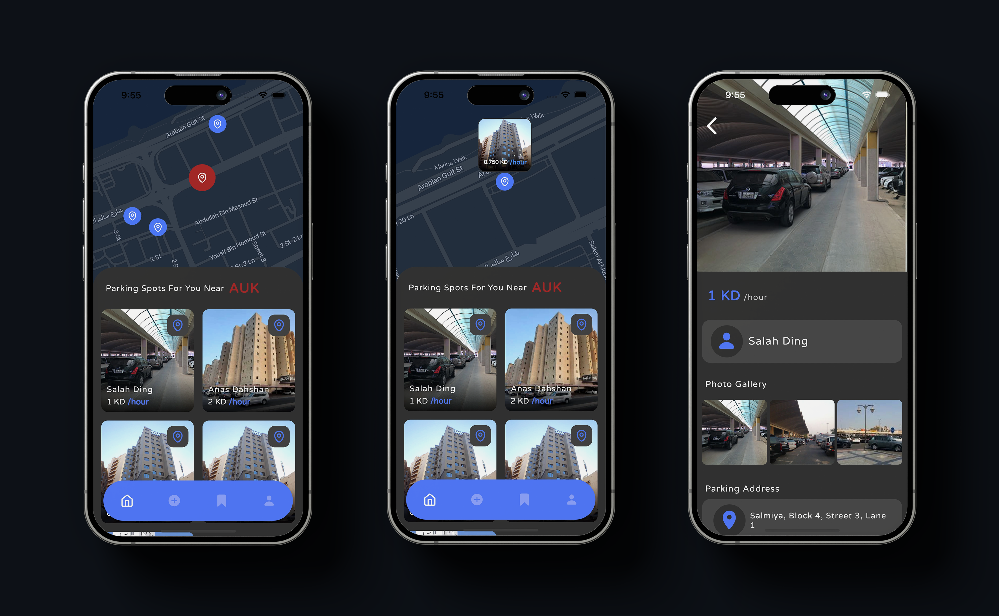
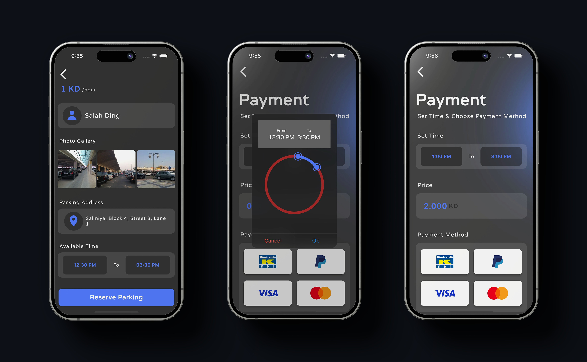
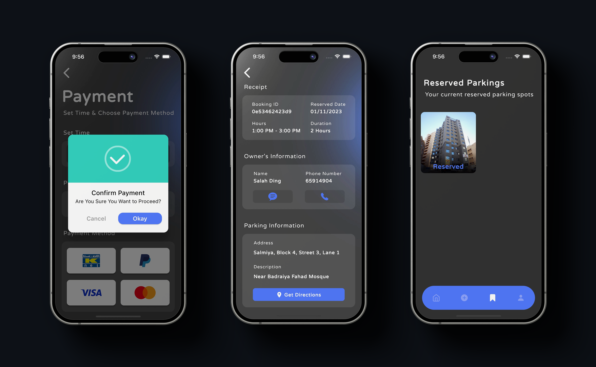
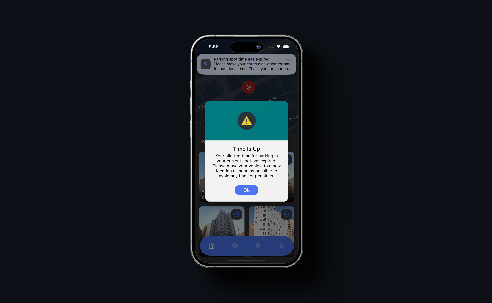

### 📌 Project-P  

Welcome to the **Project-P** repository! 🚗💨  

---

## 📚 Introduction  

**Project-P** is a **smart parking solution** designed to ease the hassle of finding and reserving parking spaces in crowded areas like **universities, business districts, and city centers**. With a user-friendly interface, secure payments, and real-time availability updates, **Project-P** streamlines the parking experience for both **drivers and parking space owners**.

---

## 🎥 Video Showcase  

 A full demo video showcasing **Project-P's** features and user experience!  

https://github.com/user-attachments/assets/95e0c06a-6ac9-4c18-8bcb-bb4c1b90d62b

---

## 🔑 Key Features  

👉 **Interactive UI** – Quick access to nearby parking spots  
👉 **Smart Search & Filtering** – Find parking based on location, availability, and price  
👉 **Seamless Booking & Payments** – Secure transactions via **Knet, PayPal, Visa, and Mastercard**  
👉 **Real-Time Map** – View available parking spaces dynamically  
👉 **User Listings** – Rent out your own parking space to earn extra income  
👉 **Favorites & Reminders** – Bookmark frequent spots and get notified before time expires  
👉 **Time Alerts & Extensions** – Never worry about parking fines! Get notified when time is running out  

---

## 🌆 Screenshots  

Here are some **screenshots** to showcase the core functionalities of **Project-P**:  

### 🎬 Splash Screens
🚀 Introducing Project-P with an engaging onboarding experience


### 🏠 Home Screen  
📍 Displays an interactive map and lists nearby parking spots  



### 🗓 Booking & Selection  
🚗 Select and book a parking spot with real-time availability  



### 💳 Payment System  
🔒 Secure payment integration with multiple options  



### ⏳ Time Expiry & Alerts  
🔔 Get notified when your parking session is ending  



---

## 🛠 Technology Used  

🚀 **Flutter** – Cross-platform mobile development  
🔥 **Firebase** – Real-time database & authentication  
🗰 **Google Maps API** – Dynamic parking location mapping  
💳 **Stripe & Knet API** – Secure online transactions  

---

## 🚀 Future Enhancements  

💡 **IoT Parking Sensors** – Real-time updates on parking availability  
💡 **AI-Powered Parking Suggestions** – Predict available spots based on usage trends  
💡 **Dynamic Pricing Model** – Adjust rates based on demand and time of day  
💡 **License Plate Recognition** – Seamless entry & exit tracking  

---

## 🛠 Getting Started  

To set up and run **Project-P** on your local machine, follow these steps:  

1️⃣ **Clone the repository**  
   ```bash
   git clone https://github.com/yourusername/Project-P.git
   cd Project-P
   ```  

2️⃣ **Install dependencies**  
   ```bash
   flutter pub get
   ```  

3️⃣ **Run the app**  
   ```bash
   flutter run
   ```  

---

## 📝 Contribution Guidelines  

We welcome contributions from the community! 🚀  

👉 **Fork** the repository  
👉 **Create a new branch** for your feature/bug fix  
👉 **Commit changes** with descriptive messages  
👉 **Push & Submit a Pull Request**  

Let’s collaborate to make **Project-P** the best parking app! 💡  

---

## 💌 License  

This project is licensed under the **MIT License** – feel free to use and modify it!  

---

### 👤 Feedback & Support  

We'd love to hear your thoughts! If you have suggestions, report issues, or want to contribute, feel free to **open an issue** or **reach out**.  

🚗 **Find a spot, park with ease – that's Project-P!**  

---
